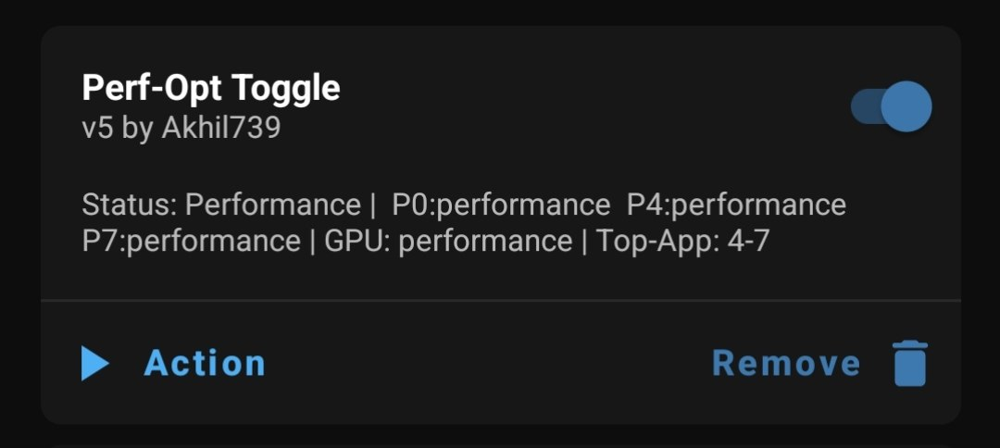

# Perf-Opt-Toggle

  

A manual performance toggle for gaming. Use the Magisk Action Button to switch CPU/GPU to "Performance" mode and optimize top-app cpusets. Tap it again to restore your original stock settings. The module description updates only when you toggle or reboot.

# CAUTION
Warning: This module is optimized for the Snapdragon 870 architecture. It applies a top-app cpuset of 4-7, which maps to the big and prime cores on this specific chipset. 
If your device has a different core layout (e.g., 10-core CPUs or different big.LITTLE configurations like 2+6), this module may not work correctly or could cause performance issues. Use with caution on other processors
